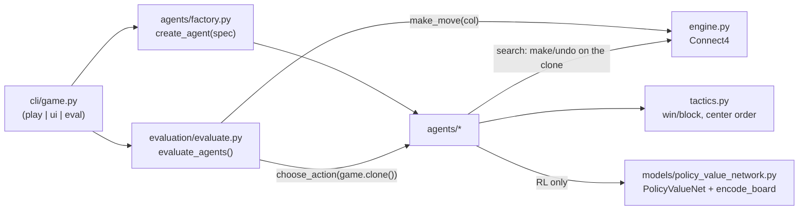
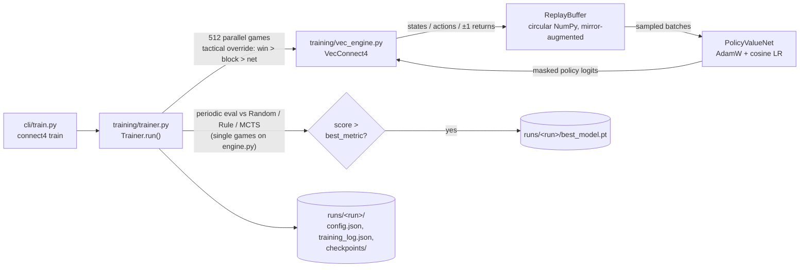

# Architecture

System design of the Connect 4 AI engine: what each module does, why there are
two game engines, how agents plug in, and the conventions every module shares.

## Module map

| Module | Role |
|---|---|
| [`engine.py`](../src/connect4/engine.py) | OO single-game engine (`Connect4`): make/undo move stack, incremental win detection, rendering |
| [`tactics.py`](../src/connect4/tactics.py) | Shared tactical helpers: `CENTER_ORDER`, `ordered_legal_moves`, `find_immediate_win` |
| [`agents/base.py`](../src/connect4/agents/base.py) | `BaseAgent` ABC: `choose_action` + stats contract |
| [`agents/human.py`](../src/connect4/agents/human.py) | Terminal input agent with input validation |
| [`agents/random.py`](../src/connect4/agents/random.py) | Uniform-random baseline |
| [`agents/rule_based.py`](../src/connect4/agents/rule_based.py) | Win → block → center heuristic baseline |
| [`agents/minimax.py`](../src/connect4/agents/minimax.py) | Depth-limited alpha-beta search with windowed positional heuristic |
| [`agents/mcts.py`](../src/connect4/agents/mcts.py) | UCT Monte Carlo Tree Search with tactical overrides, threat-aware rollouts, tree reuse |
| [`agents/rl_policy.py`](../src/connect4/agents/rl_policy.py) | Policy-network agent: masked logits, temperature sampling, tactical override |
| [`agents/factory.py`](../src/connect4/agents/factory.py) | Spec strings (`mcts-700`, `minimax-7`, `rl`, ...) → agent instances; RL checkpoint resolution |
| [`models/policy_value_network.py`](../src/connect4/models/policy_value_network.py) | `PolicyValueNet` (~2.3M-param residual CNN), `encode_board`, mirror-augmentation helpers |
| [`training/vec_engine.py`](../src/connect4/training/vec_engine.py) | `VecConnect4`: batched NumPy engine stepping hundreds of games per call |
| [`training/trainer.py`](../src/connect4/training/trainer.py) | Self-play `Trainer`: vectorized data generation, circular `ReplayBuffer`, eval-gated checkpointing |
| [`evaluation/evaluate.py`](../src/connect4/evaluation/evaluate.py) | Head-to-head runner: first-player alternation, per-move timing, `EvaluationSummary` |
| [`evaluation/tournament.py`](../src/connect4/evaluation/tournament.py) | `Matchup` runner: JSON persisted after every matchup, ETA, summary tables |
| [`ui/game_ui.py`](../src/connect4/ui/game_ui.py) | Pygame board (optional `[ui]` extra) |
| [`cli/main.py`](../src/connect4/cli/main.py) | `connect4` argparse dispatcher (stdlib-only at import time) |
| [`cli/game.py`](../src/connect4/cli/game.py), [`cli/train.py`](../src/connect4/cli/train.py), [`cli/tournament.py`](../src/connect4/cli/tournament.py), [`cli/experiment.py`](../src/connect4/cli/experiment.py) | Subcommand argument surfaces + `run_*` handlers |

## The two-engine design

The repo contains two independent implementations of Connect 4. This is
deliberate: tree search and batched RL self-play have opposite access
patterns, and neither is well served by the other's engine.

### `engine.py` — the OO single-game engine (search workload)

[`Connect4`](../src/connect4/engine.py) models one live game as a mutable
object. Its defining feature is the undo stack: every `make_move` pushes a
`MoveHistory` record (row, col, player, plus the *previous* `current_player`,
`winner`, `done`, and `last_move`), and `undo_move` pops it to restore the
exact prior state — no copying, no allocation beyond the one record.

This is what recursive search needs. Minimax and MCTS both run thousands of
`make_move`/`undo_move` pairs per decision **on the live object**: minimax's
alpha-beta recursion applies a move, recurses, and undoes it; MCTS applies
moves during selection/expansion, plays a full rollout, then unwinds the whole
path with undos. Cloning a game per tree node (the alternative) would
deep-copy the board and history at every one of those steps.

Win detection is also shaped for this workload: `check_winner(row, col)` only
scans the four line directions through the piece just placed, so the
per-move cost is a handful of cell reads rather than a full-board scan.

### `training/vec_engine.py` — the batched NumPy engine (RL workload)

[`VecConnect4`](../src/connect4/training/vec_engine.py) holds `n` games at
once as flat arrays: `boards (n, 6, 7) int8`, `_heights (n, 7)`,
`current_player`, `winner`, `done`. One `step(actions)` call advances every
non-finished game: heights give O(1) drop rows (`row = ROWS-1 - height`),
placement/draw detection/player flip are vectorized, and `reset(mask)`
recycles only finished environments. `encode(mask)` produces the network
input for all active games in one shot.

This is what GPU-fed self-play needs. The trainer steps 512 games per model
forward pass; with the per-game Python engine, each of those 512 games would
be an independent object walked in a Python loop every move. The vectorized
engine is what makes the recorded self-play throughput (93–165 episodes/s
on an RTX 2080 Ti for the v3 run) possible.

### The contract between them

The two engines share every convention: row 0 is the top of the board, the
drop row is `ROWS-1-height`, players are `1`/`2` with `0` empty. Critically,
their state encoders are kept **bit-identical**:
[`encode_board`](../src/connect4/models/policy_value_network.py) (used at
play/eval time on `Connect4`) and
[`VecConnect4.encode`](../src/connect4/training/vec_engine.py) (used during
training) produce the same 4-channel tensor for the same position. The test
suite pins this equivalence, along with move-for-move cross-validation of the
two engines — a network trained on one engine's encoding must see exactly the
same inputs when deployed against the other.

## Agent interface

Every agent extends [`BaseAgent`](../src/connect4/agents/base.py):

```python
choose_action(game) -> int   # required: return a legal column for the current player
reset_stats() -> None        # optional: clear internal counters (default no-op)
get_stats() -> dict          # optional: nested {section: {metric: value}} (default {})
```

Two contract details matter:

- **Agents receive a clone.** The evaluator
  ([`play_one_game`](../src/connect4/evaluation/evaluate.py)) calls
  `choose_action(game.clone())`, so agents may freely mutate the game they are
  handed — MCTS and minimax search in place on it with make/undo.
- **Illegal moves are fatal.** The evaluator validates the returned column
  against the *real* game and raises `ValueError` on a mismatch.

Agents are built from CLI spec strings by
[`agents/factory.py`](../src/connect4/agents/factory.py):

| Spec | Agent | Default |
|---|---|---|
| `human` | `HumanAgent` | |
| `random` | `RandomAgent` | |
| `rule` | `RuleBasedAgent` | |
| `mcts`, `mcts-<iterations>` | `MCTSAgent` | 500 iterations |
| `minimax`, `minimax-<depth>` | `MinimaxAgent` | depth 5 |
| `rl` | `RLPolicyAgent` | `runs/rl_pure_selfplay_v3/best_model.pt` |

RL checkpoints resolve via `resolve_rl_model_path`: an explicit
`--model-path` wins; otherwise `runs/<model_name>/<checkpoint>_model.pt` with
`checkpoint ∈ {best, final}`. Paths are CWD-relative — run from the repo root.

## Data flow

### Play / eval path



`connect4 tournament` and `connect4 experiment` wrap the same
`evaluate_agents` loop via
[`evaluation/tournament.py`](../src/connect4/evaluation/tournament.py),
persisting JSON to `results/` after every matchup.

### Training path



The eval loop runs the candidate network through
`evaluate_against` on the OO engine — the same code path used in the
tournament — and gates `best_model.pt` on a weighted score of the
Random/Rule/MCTS win rates.

## Key conventions

- **Board orientation** — 6 rows × 7 columns; row 0 is the **top**. A piece
  dropped in column `c` lands at `row = ROWS-1 - height(c)`.
- **Player encoding** — `EMPTY = 0`, `PLAYER1 = 1`, `PLAYER2 = 2`; rendered
  via `SYMBOLS` as `.` / `X` / `O`. Player 1 always moves first.
- **Network input** — 4-channel `(4, 6, 7)` float32 encoding from the
  **current player's perspective** (`encode_board`):
  channel 0 = current player's pieces, 1 = opponent's pieces,
  2 = side-to-move plane (all 1.0 if player 1 to move), 3 = per-column fill
  height / 6, tiled over rows. Mirror augmentation flips channel columns
  (`mirror_encoded_state`) and maps action `a → 6-a` (`mirror_action`).
- **Value convention** — the value head ends in `tanh`, so values live in
  `[-1, 1]` from the current player's perspective; training returns are
  +1 win / −1 loss / 0 draw. (MCTS internally uses a separate `[0, 1]`
  scale with draw = 0.5, from each node's `player_just_moved` perspective.)
- **Center-first ordering** — `tactics.CENTER_ORDER = (3, 2, 4, 1, 5, 0, 6)`
  is the shared strongest-first column scan used by the rule-based agent,
  MCTS expansion/rollouts, and the trainer's tactical probe. Minimax derives
  the same order independently by sorting on distance from column 3.
- **Lazy imports** — [`connect4.agents`](../src/connect4/agents/__init__.py)
  re-exports lazily (PEP 562 module `__getattr__`), and the factory imports
  `RLPolicyAgent` inside the `rl` branch, so **torch loads only when an RL
  agent is actually created**. Pygame is imported only inside `connect4 ui`.
  All `cli/*.py` modules are stdlib-only at import time so `connect4 --help`
  stays instant.

## See also

- [Agent write-ups](agents/README.md) — algorithm details and measured strength per agent
- [Future work](future-work.md) — roadmap of planned improvements
